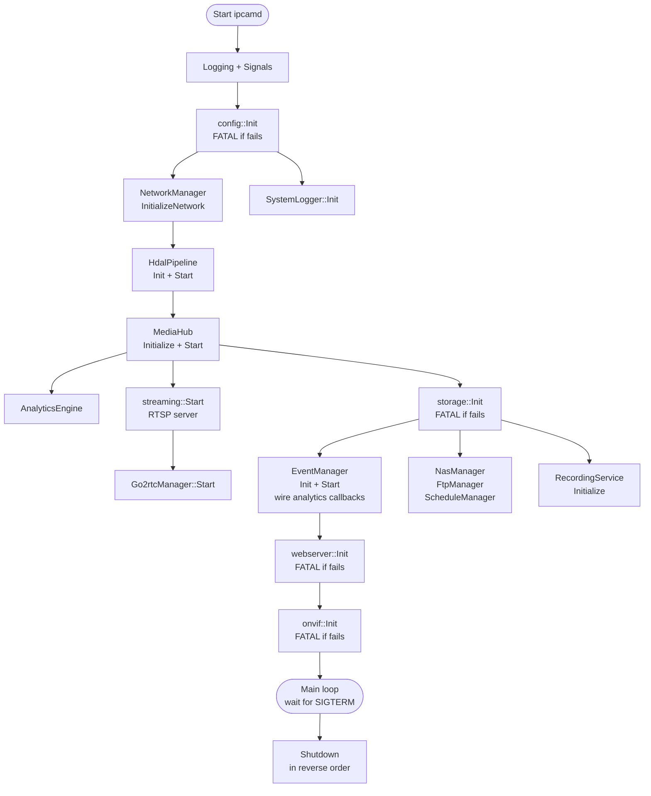
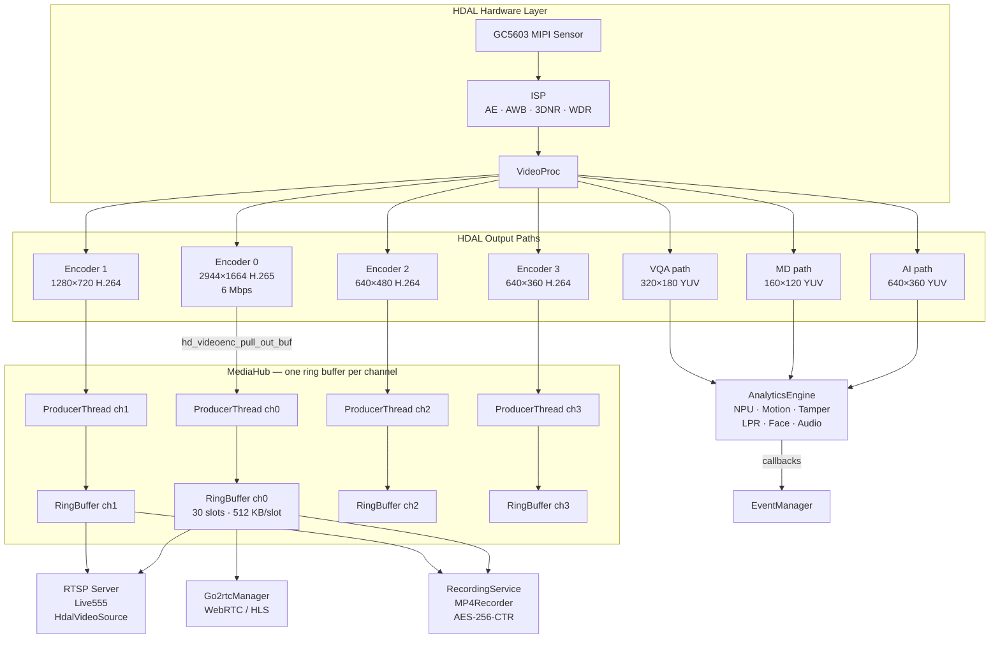
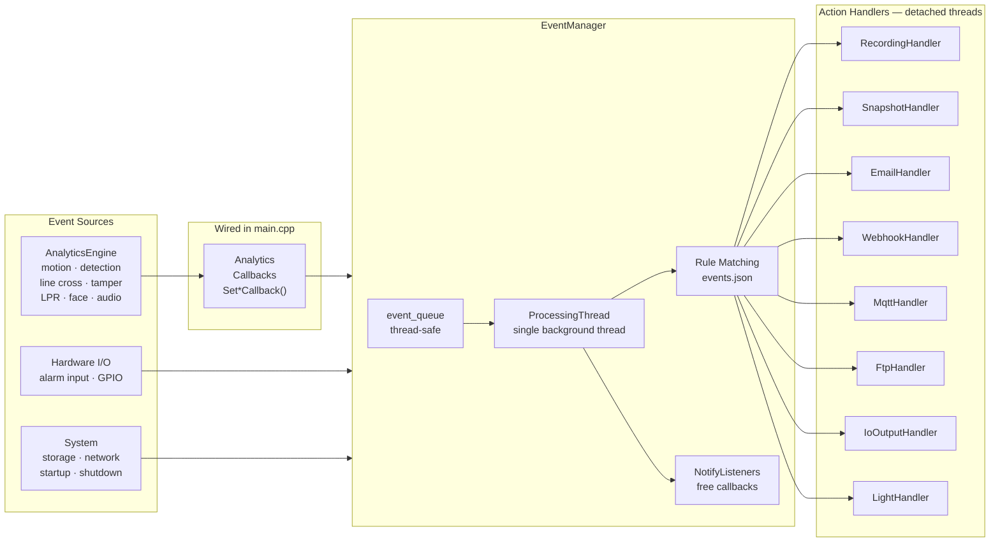
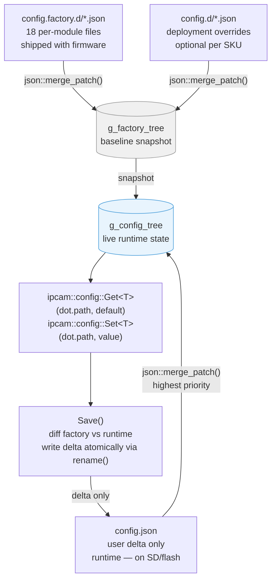
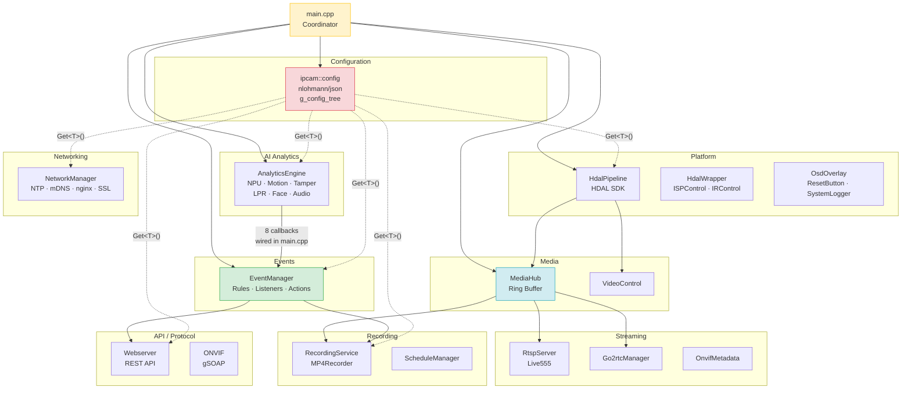

# Eterna IP Camera Application — Architecture

> **Codebase root:** `code/application/ipcamera/`  
> **Main binary:** `apps/ipcamd/src/main.cpp`  
> **Note:** Logic is complete; the binary depends on the Novatek HDAL SDK and board BSP to compile.

---

## Design Patterns at a Glance

| Pattern | Where | Purpose |
|---------|-------|---------|
| **Singleton** `X::Instance()` | All 11 modules (35 classes) | Single shared instance per manager/engine, no manual lifetime management |
| **Coordinator** | `apps/ipcamd/src/main.cpp` | Ordered startup/shutdown, cross-subsystem wiring, no business logic |
| **Publish–Subscribe** | `modules/events/` | Decouple AI/hardware event sources from notification/action consumers |
| **JSON Config per Module** | `configs/config.factory.d/*.json` | 18 factory-default files, three-layer merge, delta-only save |
| **MediaHub Ring Buffer** | `modules/media/` | SPMC ring buffer distributes encoded video to RTSP, recording, WebRTC |

---

## Table of Contents

1. [System Overview](#1-system-overview)
2. [Repository Structure](#2-repository-structure)
3. [Design Patterns](#3-design-patterns)
   - 3.1 [Singleton — `X::Instance()`](#31-singleton--xinstance)
   - 3.2 [Coordinator — `main.cpp`](#32-coordinator--maincpp)
   - 3.3 [Publish–Subscribe — EventManager](#33-publishsubscribe--eventmanager)
   - 3.4 [JSON Configuration System](#34-json-configuration-system)
   - 3.5 [MediaHub — Ring Buffer & Callbacks](#35-mediahub--ring-buffer--callbacks)
4. [Module Catalogue](#4-module-catalogue)
5. [Startup and Shutdown Sequence](#5-startup-and-shutdown-sequence)
6. [Video Pipeline Data Flow](#6-video-pipeline-data-flow)
7. [Event System Data Flow](#7-event-system-data-flow)
8. [Configuration Layering](#8-configuration-layering)
9. [Dependency Map](#9-dependency-map)

---

## 1. System Overview

`ipcamd` is a single Linux daemon that owns the full lifecycle of an Eterna IP camera:

- Captures raw sensor data via the Novatek **HDAL** (Hardware Driver Abstraction Layer) SDK.
- Encodes up to **four simultaneous H.264/H.265 video streams** and one G.711 audio stream.
- Distributes encoded video to **RTSP**, **recording**, and **WebRTC/HLS** consumers through a central ring buffer (`MediaHub`).
- Runs **on-device AI analytics** (object detection, motion, line crossing, LPR, face, audio events, tamper) via an NPU inference engine.
- Publishes all AI and sensor events through a typed **EventManager** that dispatches configurable actions (record, snapshot, email, webhook, MQTT, FTP, alarm output).
- Exposes a REST HTTP/HTTPS API, ONVIF WS-Discovery service, and mDNS/DNS-SD.

---

## 2. Repository Structure

```
code/application/ipcamera/
├── apps/
│   └── ipcamd/src/
│       └── main.cpp                 ← Coordinator / application entry point
├── configs/
│   ├── config.factory.d/            ← Per-module factory-default JSON configs (18 files)
│   └── config.d/                    ← Deployment-specific overrides (optional)
└── modules/
    ├── ai/          ← AnalyticsEngine, NPU inference, motion/tamper/LPR/face/audio
    ├── config/      ← JSON config system (nlohmann/json), UserManager (SQLite/SQLCipher)
    ├── events/      ← EventManager, EventRule, ActionHandler, action implementations
    ├── media/       ← MediaHub (ring buffer), VideoControl, AudioControl
    ├── networking/  ← NetworkManager, NTP, mDNS, nginx, SSL, SMTP, SNMP, UPnP
    ├── onvif/       ← ONVIF WS-Discovery, SOAP service (gSOAP)
    ├── platform/    ← HdalPipeline, HdalWrapper, ISPControl, IRControl, OSD, ResetButton
    ├── recording/   ← RecordingService (MP4/raw), ScheduleManager
    ├── storage/     ← NasManager (NFS/SMB), FtpManager
    ├── streaming/   ← RTSP server (Live555), Go2rtcManager, AudioFrameBroadcaster
    ├── upgrade/     ← Firmware upgrade
    ├── utils/       ← AuditLogger, shared utilities
    └── webserver/   ← HTTP REST API server
```

---

## 3. Design Patterns

### 3.1 Singleton — `X::Instance()`

Every manager and engine in the application is a **Meyers Singleton**: a class with a private constructor whose sole access point is a static `Instance()` method returning a reference to a function-local `static` object. The C++11 standard guarantees this initialisation is thread-safe without any additional locking.

**Universal implementation (identical across all 35 classes):**

```cpp
// Header
class NetworkManager {
public:
    static NetworkManager& Instance();
private:
    NetworkManager() = default;
    NetworkManager(const NetworkManager&) = delete;
    NetworkManager& operator=(const NetworkManager&) = delete;
};

// Source
NetworkManager& NetworkManager::Instance() {
    static NetworkManager instance;
    return instance;
}
```

**Complete singleton inventory:**

| Class | Namespace | Module | Role |
|-------|-----------|--------|------|
| `EventManager` | `ipcam::events` | events | Event queue, rule matching, action dispatch |
| `AnalyticsEngine` | `ipcam::ai` | ai | AI inference orchestration |
| `NpuInference` | `ipcam::ai` | ai | NPU model runner (YOLOv5s) |
| `TamperDetectionEngine` | `ipcam::ai` | ai | Video tamper detection |
| `MotionDetectionEngine` | `ipcam::ai` | ai | Pixel-based motion detection |
| `ObjectTracker` | `ipcam::ai` | ai | Multi-object tracking |
| `VqaEngine` | `ipcam::ai` | ai | Video quality analysis |
| `PrivacyMosaicEngine` | `ipcam::ai` | ai | Privacy mask / blur |
| `AiispEngine` | `ipcam::ai` | ai | AI-based ISP enhancement |
| `HdalPipeline` | `ipcam::platform` | platform | Novatek HDAL sensor/encoder pipeline |
| `HdalWrapper` | `ipcam::platform` | platform | Vendor ISP tuning API wrapper |
| `ISPControl` | `ipcam::platform` | platform | High-level ISP image quality API |
| `IRControl` | `ipcam::platform` | platform | IR LED, IR cut filter, day/night |
| `OsdOverlay` | `ipcam::platform` | platform | On-screen display (timestamp, logo, masks) |
| `ResetButton` | `ipcam::platform` | platform | GPIO factory-reset button monitor |
| `SystemLogger` | `ipcam::platform` | platform | Periodic system data collector |
| `MediaHub` | `ipcam::media` | media | Ring buffer + consumer notification |
| `VideoControl` | `ipcam::media` | media | Encoder parameter API bridge |
| `AudioControl` | `ipcam::media` | media | Audio parameter API bridge |
| `RecordingService` | `ipcam::recording` | recording | MP4/raw segment recording to SD card |
| `ScheduleManager` | `ipcam::recording` | recording | Scheduled recording triggers |
| `NasManager` | `ipcam::storage` | storage | NFS/SMB network storage |
| `FtpManager` | `ipcam::storage` | storage | FTP upload queue |
| `NetworkManager` | `ipcam::networking` | networking | Network interface and service facade |
| `NtpManager` | `ipcam::networking` | networking | Pure-C++ NTP sync |
| `NginxManager` | `ipcam::networking` | networking | nginx config and process control |
| `SslManager` | `ipcam::networking` | networking | SSL certificate lifecycle |
| `MdnsResponder` | *(global)* | networking | mDNS/DNS-SD via raw sockets (`GetInstance()`)¹ |
| `Go2rtcManager` | `ipcam::streaming` | streaming | WebRTC/HLS restreamer |
| `AudioFrameBroadcaster` | `ipcam::streaming` | streaming | Audio consumer distribution |
| `OnvifMetadataGenerator` | `ipcam::streaming` | streaming | ONVIF metadata stream |
| `AuditLogger` | *(utils)* | utils | Security audit log |
| `PasswordCrypto` | *(webserver)* | webserver | Password hashing helper |
| `ConfigLoader` | `ipcam::config` | config | YAML-based config loader (secondary path) |

> ¹ `MdnsResponder` is the only class that uses `GetInstance()` instead of `Instance()`. The body is identical.

The config module additionally uses **anonymous-namespace module-level statics** (`g_config_tree`, `g_factory_tree`, `g_mutex`) — effectively the same pattern without a class wrapper.

---

### 3.2 Coordinator — `main.cpp`

`apps/ipcamd/src/main.cpp` is the **central orchestrator**. It contains no business logic. Its responsibilities are:

1. Initialise logging (multi-sink spdlog: rotating file at DEBUG + coloured stdout at INFO).
2. Install signal handlers (`SIGINT`/`SIGTERM` → `g_running = false`).
3. Parse CLI arguments (`-c/--config` to override the config directory).
4. **Start subsystems in strict dependency order** — each subsystem is up before any that depends on it.
5. **Wire AI analytics callbacks to EventManager** — `main.cpp` is the only place that sees both `AnalyticsEngine` and `EventManager`, and it stitches them together with lambdas.
6. Block in the main loop until a shutdown signal.
7. **Tear down subsystems in reverse dependency order**.

This keeps every module independent. No module imports another module's singleton directly in ways that create circular dependencies; all cross-cutting wiring happens in `main.cpp`.

**Startup sequence:**

| # | Call | Fatal? | Key dependency |
|---|------|--------|----------------|
| 1 | Logging (spdlog) | — | — |
| 2 | Signal handlers | — | — |
| 3 | CLI argument parsing | — | — |
| 4 | `ipcam::config::Init()` | **Yes** (exit 2) | None — must be first |
| 5 | `NetworkManager::Instance().InitializeNetwork()` | No | Config |
| 6 | `SystemLogger::Instance().Init()` | No | Config |
| 7 | `HdalPipeline::Instance().Init()` + `.Start()` | No | Config |
| 8 | `MediaHub::Instance().Initialize()` + `.Start()` | No | **HdalPipeline** |
| 9 | `AnalyticsEngine::Instance()` | No | HdalPipeline (VideoProc paths) |
| 10 | `VideoControl::Instance().Init()` | No | HdalPipeline |
| 11 | `IRControl::Instance().Init()` | No | Config |
| 12 | `ResetButton::Instance().Init()` | No | Config |
| 13 | `ipcam::streaming::Initialize()` + `::Start()` | No | **MediaHub** |
| 14 | `Go2rtcManager::Instance().Start()` | No | RTSP server |
| 15 | `ipcam::storage::Init()` | **Yes** (exit 3) | Config |
| 16 | `NasManager::Instance().Init()` | No | Storage |
| 17 | `EventManager::Instance().Init()` + `.Start()` | No | All the above |
| 18 | `FtpManager::Instance().Init()` | No | Storage |
| 19 | `ScheduleManager::Instance().Init()` | No | Storage |
| 20 | `VideoControl::Instance().Init()` | No | HdalPipeline |
| 21 | `RecordingService::Instance().Initialize()` | No | **Storage + MediaHub** |
| 22 | `ipcam::webserver::Init()` | **Yes** (exit 4) | All the above |
| 23 | `ipcam::onvif::Init()` | **Yes** (exit 5) | Network + Storage |

**Shutdown sequence (reverse dependency order):**

```
EventManager.Stop()       → RecordingService → ScheduleManager → FtpManager → NasManager
→ AnalyticsEngine → SystemLogger → IRControl → ResetButton
→ Go2rtcManager → RTSP server → MediaHub → HdalPipeline
→ ONVIF → Webserver → Storage → Config
→ _Exit(0)   ← bypasses C++ static destructors (SQLCipher safety)
```

---

### 3.3 Publish–Subscribe — EventManager

The application uses a **typed publish–subscribe** pattern to decouple event sources (AI analytics, hardware I/O, storage, network) from consumers (recording, snapshot, email, webhook, MQTT, FTP, alarm outputs, ONVIF).

#### Core Types

```
EventCategory  — 9 values:
  kMotion · kAnalytics · kLineCrossing · kIntrusion
  kSystem · kIO · kStorage · kNetwork · kSchedule

EventType      — 40+ values:
  kMotionStart/End · kPersonDetected/Lost · kVehicleDetected · kFaceDetected
  kLineCrossed* · kZoneEntered · kZoneLoitering
  kTamperDetected/Cleared · kLprDetected · kAudioDetected
  kSystemStartup/Shutdown · kAlarmInputTriggered · kStorageMounted/Full · ...

ActionType     — 21 values:
  kStartRecording · kCaptureSnapshot · kSendEmail · kSendWebhook
  kPublishMqtt · kUploadFtp · kPublishOnvifEvent
  kTriggerAlarmOutput · kActivateLight · kPlaySiren · ...

EventData      — std::variant over 11 typed payload structs
```

#### Publishing

Any subsystem calls a convenience method — it constructs a typed `Event`, enqueues it, and signals a `condition_variable`. Publishing is **non-blocking and thread-safe**.

```cpp
EventManager::Instance().PublishMotionStart({zone_id}, confidence);
EventManager::Instance().PublishPersonDetected(detected_object);
EventManager::Instance().PublishLineCrossed(line_id, name, "any", object_id, class_name);
EventManager::Instance().PublishSystemEvent(EventType::kSystemStartup, "ipcamd", msg, 0);
```

#### Subscribing (Listeners)

```cpp
using EventListener = std::function<void(const Event&)>;
using EventFilter   = std::function<bool(const Event&)>;

uint32_t id = EventManager::Instance().AddListener(
    [](const Event& e) { /* handle */ },
    [](const Event& e) { return e.type == EventType::kPersonDetected; }  // optional filter
);
EventManager::Instance().RemoveListener(id);
```

All listeners are called on the single background `ProcessingThread`. Exceptions are caught and logged; they never kill the thread.

#### Rule-Based Action Dispatch

`EventManager` also maintains an `EventRule` list (loaded from `events.json`). Each rule specifies trigger conditions (event types, schedule, min confidence) and a list of `Action` objects. Matching events trigger `ActionHandler::Execute()` in **detached threads** so the processing thread is never blocked.

#### Analytics → EventManager Wiring (done in `main.cpp`)

```
AnalyticsEngine setter          EventManager publish method
──────────────────────────      ──────────────────────────────────
SetMotionCallback()        →    PublishMotionStart() / PublishMotionEnd()
SetDetectionCallback()     →    PublishPersonDetected() / PublishVehicleDetected() / PublishFaceDetected()
SetLineCrossCallback()     →    PublishLineCrossed()
SetLoiteringCallback()     →    PublishZoneIntrusion()
SetTamperCallback()        →    PublishTamperEvent()
SetFaceRecognitionCallback()→   PublishFaceDetected()
SetLprCallback()           →    PublishLprDetected()
SetAudioEventCallback()    →    PublishAudioDetected()
```

#### Action Handlers

| Handler class | `ActionType`(s) | Backend |
|--------------|-----------------|---------|
| `RecordingActionHandler` | `kStartRecording` | `RecordingService::Instance()` |
| `SnapshotActionHandler` | `kCaptureSnapshot`, `kGenerateThumbnail` | `VideoControl::Instance()` |
| `EmailActionHandler` | `kSendEmail` | `SmtpManager` (libcurl) |
| `WebhookActionHandler` | `kSendWebhook` | libcurl HTTP POST/PUT/GET with retry |
| `MqttActionHandler` | `kPublishMqtt` | Paho MQTT `async_client` (conditional compile) |
| `FtpUploadHandler` | `kUploadFtp` | `FtpManager::Instance()` |
| `IoOutputHandler` | `kTriggerAlarmOutput`, `kClearAlarmOutput` | `IRControl::Instance()` (PWM) |
| `LightActionHandler` | `kActivateLight`, `kDeactivateLight` | `IRControl::Instance()` (solid/flash/strobe) |
| `SirenActionHandler` | `kPlaySiren`, `kStopSiren` | Stub (pending audio integration) |

All handlers inherit from `ActionHandler`, which provides `ExecuteAsync()` and `SubstitutePlaceholders()` for template strings (`{event_id}`, `{timestamp}`, `{object_class}`, `{snapshot_path}`, etc.).

---

### 3.4 JSON Configuration System

Implemented in `modules/config/` using **nlohmann/json**. Provides a three-layer merge strategy and a free-function API — no config handle or dependency-injected object needed.

#### Access API

```cpp
// Read (any module, any thread — config::Init() must have completed):
int  port    = ipcam::config::Get<int>("network.rtsp.port", 554);
bool enabled = ipcam::config::Get<bool>("streaming.rtsp.enabled", true);
auto server  = ipcam::config::GetOptional<std::string>("network.smtp.server");

// Write and persist:
ipcam::config::Set<int>("network.rtsp.port", 8554);
ipcam::config::Save();   // atomic rename; writes only the user delta
```

**Dot-path notation** with array index support:  
`"network.ipv4.address"` → nested object · `"storage.channels[0].id"` → array element

#### Three-Layer Merge

| Layer | Path | Description |
|-------|------|-------------|
| 1 — Factory (lowest) | `config.factory.d/*.json` | Per-module defaults shipped with firmware |
| 2 — Deployment | `config.d/*.json` | Per-SKU/deployment overrides (optional) |
| *(snapshot)* | *(internal)* | `g_factory_tree` — baseline for delta computation |
| 3 — User (highest) | `config.json` | Only user-changed keys; generated at runtime |

Files within each layer are sorted alphabetically and merged via `json::merge_patch()`.

#### Delta-Only Save

`Save()` computes `diff(g_factory_tree, g_config_tree)` and writes **only the changed keys** to `config.json` via an atomic `rename()` of a `.tmp` file. If no user changes exist, `config.json` is deleted — factory defaults apply cleanly on next boot. Factory reset is therefore just deleting `config.json`.

#### Factory-Default Config Files (18 files)

| File | Module |
|------|----|
| `device.json` | Device identity, model, firmware versions, sensor capabilities |
| `media.json` | Sensor driver, ISP tuning path, encoder configs (4 streams), audio |
| `isp.json` | Image quality sliders, white balance, exposure, 3DNR/WDR, day/night |
| `osd.json` | Per-stream OSD layout, timestamp format, logo, privacy masks |
| `streaming.json` | RTSP server (Live555), go2rtc restreamer |
| `network.json` | Interfaces, ports, IP config, DNS, hostname, mDNS, SMTP, SNMP, UPnP |
| `onvif.json` | WS-Discovery (UDP 3702), ONVIF service port (TCP 5000) |
| `ir.json` | IR LED PWM, IR cut filter GPIO, auto day/night thresholds |
| `analytics.json` | All AI modules: motion zones, object detection, line crossing, LPR, face, audio, NPU |
| `events.json` | 5 pre-defined event rules, action configs, alarm I/O, notification endpoints |
| `recording.json` | Schedule profile path, NAS, FTP |
| `recording/profiles/default-24x7.json` | Continuous 24×7 schedule (all 7 days × 24 hours) |
| `storage.json` | SD card mount, AES-256-CTR encryption, SQLite DB paths |
| `auth.json` | User DB path, session TTL, password policy (PBKDF2 100k iterations) |
| `logging.json` | spdlog sinks, access/security/audit/remote syslog, SystemLogger sources |
| `system.json` | Timezone, NTP servers, DST, watchdog, memory thresholds |
| `web_portal.json` | HTTP API port, threads, session limits, rate limiting, CORS |
| `reset_button.json` | GPIO pin, hold duration, debounce, poll interval |

---

### 3.5 MediaHub — Ring Buffer & Callbacks

`MediaHub` (`modules/media/`) is the **central media distribution hub**. It decouples the single HDAL encoder output from an arbitrary number of simultaneous consumers using a **Single-Producer Multiple-Consumer (SPMC) ring buffer** per video channel.

#### Ring Buffer Specification

| Property | Value |
|----------|-------|
| Slots per channel | **30** — 1 second at 30 fps |
| Main stream max frame size | 512 KB |
| Sub-stream max frame size | 128–256 KB |
| Main stream total buffer | 30 × 512 KB = **15 MB** |
| Write concurrency | **Single producer** (`ProducerThread` per channel) |
| Read concurrency | **Unlimited consumers** — each holds its own `next_sequence_` cursor |
| Torn-read protection | Version field: **odd** = write in progress, **even** = ready to read |

Each slot stores: full encoded frame (all NAL units), SPS/PPS/VPS parameter sets, per-NAL boundary info, hardware timestamp, and codec type.

#### Write Path (Producer)

```cpp
// One ProducerThread per channel:
while (!stop_requested) {
    hd_videoenc_pull_out_buf(enc_path, &data_pull, timeout); // blocks until frame ready
    // Assemble NAL packs; detect IDR; cache SPS/PPS/VPS
    ring_buffer.Write(data, size, timestamp, channel, is_keyframe, codec, sps, pps, vps, nal_packs);
    hd_videoenc_release_out_buf(enc_path, &data_pull);       // release immediately after copy
    frame_cv.notify_all();                                   // wake all waiting consumers
}
```

The encoder output buffer is `mmap`'d at startup; pointer arithmetic (`vir_addr + phy_addr_offset`) gives near-zero-copy into the ring buffer slot.

#### Read Path (Consumer)

```cpp
bool VideoFrameConsumer::WaitForFrame(VideoFrame& out_frame, int timeout_ms) {
    if (GetNextFrame(out_frame)) return true;     // already available
    frame_cv.wait_for(lock, timeout_ms_duration); // block until producer signals
    return GetNextFrame(out_frame);
}
```

If a consumer falls behind (its target slot was overwritten), `AdvanceToValidSequence()` auto-skips to the nearest IDR after the oldest available slot and increments `frames_dropped_`. This prevents slow consumers from stalling the producer.

#### Late-Join Support

On construction, each `VideoFrameConsumer` calls `ResetToKeyframe()`, which scans the ring buffer for the most recent IDR. The consumer immediately has a valid decode entry point plus cached SPS/PPS/VPS — no waiting for the next keyframe.

#### Pause/Resume for Codec Changes

`VideoControl::ApplyToHardware()` orchestrates live parameter changes safely:

```
1. MediaHub::PauseChannel(ch)          → producer enters idle loop
2. HdalPipeline::Set*(...)             → change codec/bitrate/resolution/fps in HDAL
3. MediaHub::ResumeChannel(ch, changed) → clear SPS/PPS cache, flush stale frames, request IDR, resume producer
4. RtspServer::RefreshStream(ch)        → rebuild Live555 subsession with new codec
5. RecordingService::CutNow(ch)         → rotate MP4 segment at codec boundary
```

---

## 4. Module Catalogue

### `modules/ai` — AI Analytics

Orchestrated by `AnalyticsEngine`. All subsystems fire events via callbacks wired in `main.cpp`.

| Sub-engine | Input | Function |
|-----------|-------|----------|
| `NpuInference` | 640×360 YUV from HDAL VideoProc | Runs YOLOv5s ONNX on NPU |
| `MotionDetectionEngine` | 160×120 YUV | Pixel-diff over configurable zones |
| `ObjectTracker` | Detection results | Multi-object tracking; emits per-track-ID events |
| `TamperDetectionEngine` | 320×180 YUV (VQA path) | Laplacian variance + scene change |
| `VqaEngine` | VQA path | Video quality analysis |
| `PrivacyMosaicEngine` | VideoProc | Mosaic blur on configured regions |
| `AiispEngine` | VideoProc | AI ISP enhancement for low-light |
| *(inline engines)* | — | Line crossing, zone intrusion, people counting, face, LPR, audio classification |

### `modules/platform` — Hardware Abstraction

| Class | Responsibility |
|-------|---------------|
| `HdalPipeline` | Sole owner of all HDAL path IDs. Opens sensor, ISP, VideoProc, up to 4 encoder paths, 1 audio path, AI/MD/VQA dedicated paths. Split into `_init`, `_lifecycle`, `_video`, `_audio`, `_config` source files. |
| `HdalWrapper` | Wraps `vendor_isp_*` APIs; normalises all settings to 0–100 before calling vendor enums. |
| `ISPControl` | High-level typed structs (`ImageAdjustment`, `WhiteBalance`, `ExposureSettings`, …) over `HdalWrapper`. Loads/saves `isp.json`. |
| `IRControl` | IR LED brightness via PWM ch. 11; IR cut filter via dual-GPIO H-bridge pulse; auto day/night via SW-CDS thresholds or schedule. |
| `OsdOverlay` | FreeType-based timestamp/text/logo overlays; up to 4 privacy masks per stream; font auto-scales with stream resolution. |
| `ResetButton` | Polls GPIO12 at 100 ms; 10-second hold triggers factory reset callback. |
| `SystemLogger` | Replaces `system_logger.sh`; collects dmesg, SoC temperature, CPU/mem/disk metrics; writes to SD card (30-day retention) and flash (3 MB cap). |

### `modules/media` — Media Distribution

| Class | Responsibility |
|-------|---------------|
| `MediaHub` | Ring buffer hub — see §3.5. |
| `VideoControl` | Serialises concurrent API calls; orchestrates pause/resume cycle; fires `codec_change_callback_` to notify RTSP server. |
| `AudioControl` | Audio capture config; provides frames to `AudioFrameBroadcaster`. |

### `modules/streaming` — Output Streams

| Component | Description |
|-----------|-------------|
| RTSP server | Live555-based. `HdalVideoSource` is a `FramedSource` subclass; calls `VideoFrameConsumer::WaitForFrame()`; strips Annex-B start codes; computes RTP timestamps from HDAL hardware timestamps. Supports H.264 and H.265. |
| `Go2rtcManager` | Manages go2rtc process for WebRTC/HLS alongside RTSP. |
| `AudioFrameBroadcaster` | Distributes G.711 (RTSP) and AAC-LC (recording) audio frames. |
| `OnvifMetadataGenerator` | ONVIF metadata stream with bounding-box XML; fed from `DetectionCallback`. |

### `modules/recording` — SD Card Recording

| Component | Description |
|-----------|-------------|
| `RecordingService` | One `RecordingThread` per channel; creates `VideoFrameConsumer`; writes MP4 via `MP4Recorder` (minimp4) or raw Annex-B; optional AES-256-CTR encryption; rotates on timer, forced cut, or codec change. |
| `ScheduleManager` | Polls schedule config; calls `RecordingService::Start/Stop` on boundary crossings. |
| `MP4Recorder` | Handles Annex-B stripping, SPS/PPS/VPS `hvcC`/`avcC` box creation, fragmented MP4 writes, audio track muxing. |

### `modules/events` — Event System

| File | Responsibility |
|------|---------------|
| `event_types.h/.cpp` | `EventType`, `EventCategory`, `ActionType`, `EventData` variant, `Event` struct |
| `event_rule.h/.cpp` | `EventRule`, `Action`, `ActionConfig` — rule matching logic |
| `event_manager.h/.cpp` | Queue, processing thread, listener registry, rule engine, action dispatch |
| `action_handler.h/.cpp` | Base class, `ActionHandlerFactory::RegisterAll()`, `SubstitutePlaceholders()` |
| `src/actions/recording_action.cpp` | Recording handler |
| `src/actions/snapshot_action.cpp` | Snapshot / thumbnail handler |
| `src/actions/email_action.cpp` | Email handler (SMTP via SmtpManager) |
| `src/actions/webhook_action.cpp` | HTTP webhook handler (libcurl, with retry) |
| `src/actions/mqtt_action.cpp` | MQTT publish handler (Paho, conditionally compiled) |
| `src/actions/ftp_action.cpp` | FTP upload handler |
| `src/actions/io_action.cpp` | Alarm output, white light, siren handlers |

### `modules/networking` — Network Services

| Class | Description |
|-------|-------------|
| `NetworkManager` | Facade: IPv4/v6 config, DNS, hostname, SSL certs, nginx, NTP, SMTP, SNMP, UPnP, WiFi, link monitor. |
| `NtpManager` | Pure C++ RFC 5905 NTP — no `ntpd` dependency. Fallback through pool servers then hardcoded IPs (Google 216.239.35.0, Cloudflare 162.159.200.1, NIST 129.6.15.28, Apple 17.253.34.123). |
| `NginxManager` | Generates `nginx.conf` from current settings; manages nginx process. |
| `SslManager` | Self-signed cert generation (2048-bit RSA, 10 years) or custom PEM install with validation. |
| `MdnsResponder` | Lightweight mDNS/DNS-SD via raw sockets and `IP_ADD_MEMBERSHIP`; no avahi/dbus; announces `_http._tcp`, `_https._tcp`, `_rtsp._tcp`, `_onvif._tcp`. |
| `SmtpManager` | SMTP (none/SSL-TLS/STARTTLS) via libcurl; credentials in `CredentialManager`. |
| `SnmpManager` | SNMPv1/v2c/v3 daemon config + process management. |
| `UpnpManager` | miniupnpc-based UPnP discovery and port mapping. |

### `modules/config` — Configuration

- **Config free-functions** — `ipcam::config::Get<T>()`, `Set<T>()`, `Save()`, etc. (see §3.4).
- **UserManager** — SQLite+SQLCipher; PBKDF2-HMAC-SHA256 (210,000 iterations) for passwords; AES-256-GCM for ONVIF WSSE plaintext; brute-force lockout (5 attempts → 15 min).
- **paths.h** — All filesystem path constants as `constexpr` strings (config dir, DB paths, SD mount, model dir, etc.).

### `modules/onvif` — ONVIF Protocol

ONVIF WS-Discovery (UDP 3702) and SOAP service (TCP 5000) generated via gSOAP. Exposes Device, Media, Events, and PTZ (stub) services.

### `modules/webserver` — REST API

Embedded HTTP/HTTPS server (default port 8082). Handlers cover: device info, network, video streams, ISP/image, recording, storage, users/auth, events, analytics, system info/logs, firmware upgrade. Dedicated `src/handlers/analytics/` for AI-related endpoints.

---

## 5. Startup and Shutdown Sequence



---

## 6. Video Pipeline Data Flow



---

## 7. Event System Data Flow



---

## 8. Configuration Layering



**Factory reset** = delete `config.json` → on next boot `g_config_tree == g_factory_tree`.

---

## 9. Dependency Map



---

*Generated from source inspection of `code/application/ipcamera/` — branch `cursor/eterna-architecture-documentation-7d1e`.*
